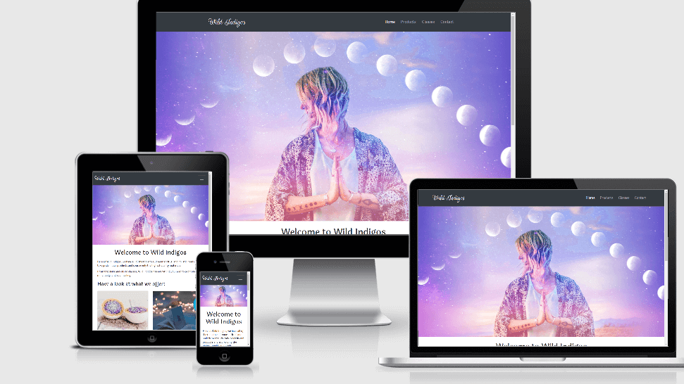

# *Wild Indigos*

Wild Indigos is a spiritual and holistic minded brand and community.
We promote whole body health and wellness. Our mindful approach to healthy and connected living drives our community bond and we want this website to represent the abundance of that.

 
 
 # UX

*	As a user I want to easily understand what it is I am looking at. 

*	As a user I want an obvious navigation link that lets me easily go to different pages in the site.

*	As a user I want to be able to find what I am looking for easily. 

*   As a user  I want to easily be able to view the website on any size screen.

*   As a user, I want to browse merchandise.

     The merchandise section can be found by clicking “Products” on the navigation bar. Upon arrival to the products page, user can use scroll feature to find the specific card for bracelets. 
     The user will then be greeted with a “Coming Soon” button as this is MS1 and I have yet to learn how to implement a wide variety of products or a shopping cart. 

* As a user, I want to search for body products.

    The body products section can be found by clicking “Products” on the navigation bar. Upon arrival to the products page, user can use scroll feature to find the specific card for bracelets. 
    The user will then be greeted with a “Coming Soon” button as this is MS1 and I have yet to learn how to implement a wide variety of products or a shopping cart. 

* As a user I want to sign up for classes.

    The user can click the “Classes” link on the navigation bar. Upon arrival at the Classes page. The user will be met with a “Sign Up!” button. 
    The user will then click the button and form will appear. 

# Wireframes  

 (quite possibly the world's worst wireframes...but wireframes nonetheless)

 * [Basic Wireframes]() 

 * [Final Wireframes](assets/wireframs/Wireframes.pdf)

# Existing Features

*   Navigation bar allows users to easily choose the different pages they would like to visit.

*	Footer  allows users to easily access our media sites where they have a chance to have more interaction with our brand.

*	Forms that allow users to contact us.

*   Social links allow users to easily acces our site.

# Features Left to Implement

*	A Product Listing Page needs to be added.

*	A Shopping Cart feature needs to be added.

*   The form buttons will need to actually send somewhere.

# Technologies Used

1.	HTML5

2.	CSS

3.	Bootstrap

4.   Github 

5.   Git

7.   W3C validation

 # Testing

*    Each page on the website was tested for screen resposiveness to ensure breakpoints.

*    The code was ran through each specific validator to make sure it passed.

*    

 # Content

*	The images were taken from: https://www.unsplash.com

*   Navbar and Cards were taken from: http://www.bootstrap.com

*   The responsive image was taken from: http://ami.responsivedesign.is/
 
*   The images were resized with: https://tinypng.com/

*   The font was taken from: https://googlefonts.com/

*   The icons were taken from: https://fontawesome.com/

 # Credits

*	Code Institute

*	ALL of the Tutors who have helped me up to this point.

*	Slack. For where would any new developers be without Slack? Shoutout to old school developers that had to learn without that support system. 
    Specifically Anna Greaves and Simen Daehlin aka "Grandmaster Yoda," as it is always, at least 95% of the time, their answers that pop-up when I search for something on Slack. 
    Those two could run the entire code world. 

*	Ignatius Ukwuoma, my mentor, for helping to guide me through ideas for my project and giving me motivation.

*	Jim Lynx for helping me sort out a bracket and CSS issues as well as the valuable feedback and advice when I was ready to quit. Jim should be hired immediately at
    Code Institute as a mentor upon completion... or now for MS1 projects. 

*	Kevin Powell and his very awesome and concise videos. 

*	Learn Code Institute for their videos as well.

(In addition, if it is not obvious, you should also describe how to run your code locally.)

