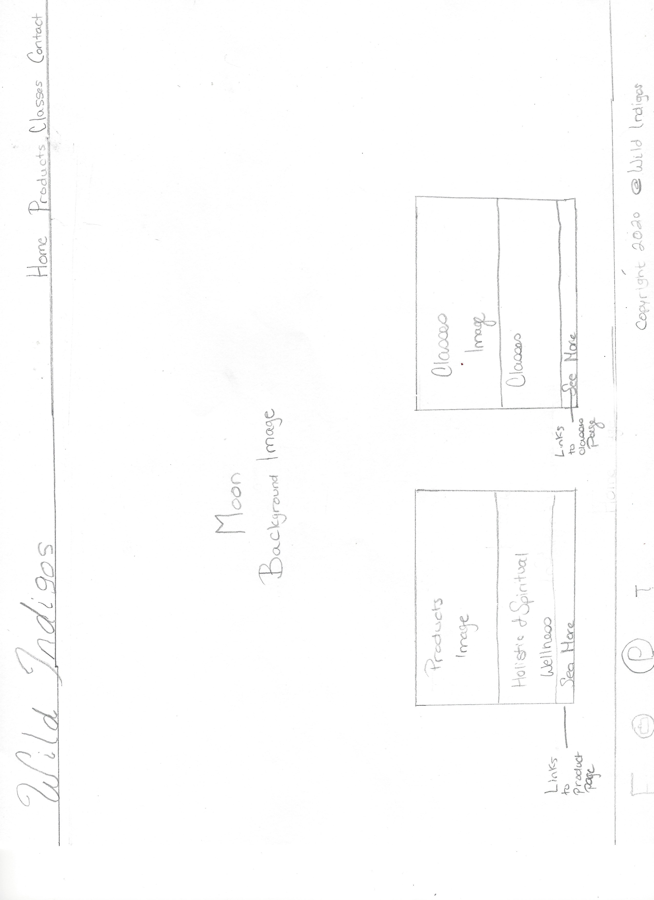
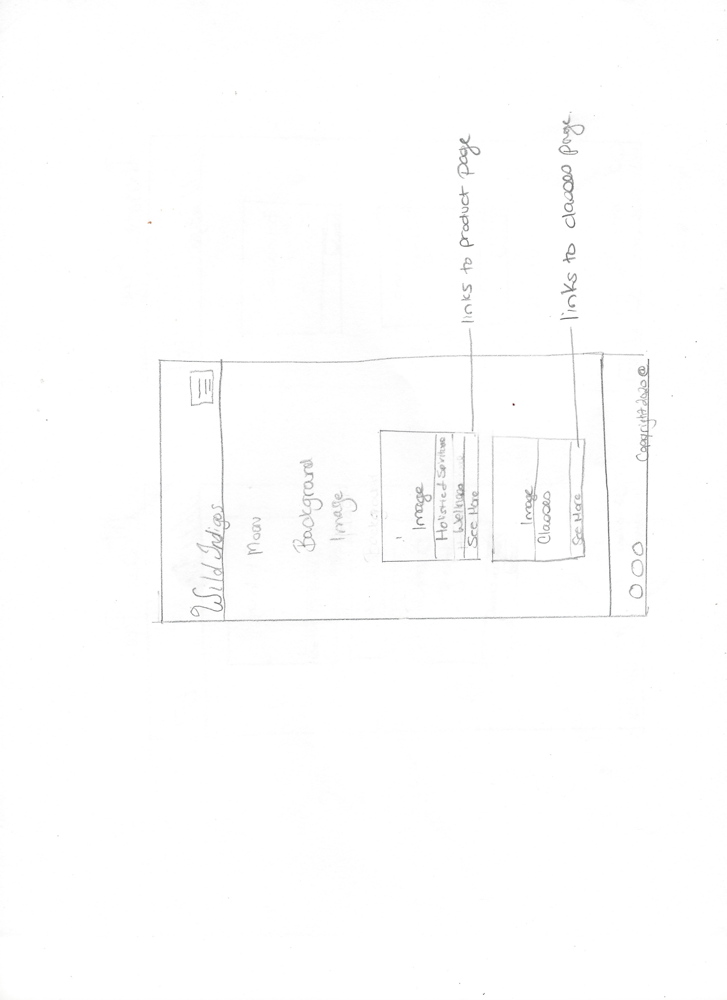

Wild Indigos is a spiritual and holistic minded brand and community. As soon as you enter in, we want you to feel immersed in beauty and magic. We promote whole body health and wellness. Our mindful approach to healthy and connected living drives our community bond and we want this website to represent the abundance of that.

#H1 **UX**

#H1 **UX**

Use this section to provide insight into your UX process, focusing on who this website is for, what it is that they want to achieve and how your project is the best way to help them achieve these things.
In particular, as part of this section we recommend that you provide a list of User Stories, with the following general structure:

•	As a user, I want to easily understand what it is I am looking at. 
•	As a user, I want an obvious navigation link that lets me easily go to different pages in the site.
•	As a user
This section is also where you would share links to any wireframes, mockups, diagrams etc. that you created as part of the design process. These files should themselves either be included as a pdf file in the project itself (in an separate directory), or just hosted elsewhere online and can be in any format that is viewable inside the browser.
Features
In this section, you should go over the different parts of your project, and describe each in a sentence or so.

#H1 Existing Features

•	Feature 1 – Navigation bar allows users to easily choose the different pages they would like to visit.
•	Feature 2- Footer  allows users to easily access our media sites where they have a chance to have more interaction with our brand.
•	Feature 3 - Forms that allow users to sign up for class notifications.

For some/all of your features, you may choose to reference the specific project files that implement them, although this is entirely optional.
In addition, you may also use this section to discuss plans for additional features to be implemented in the future:

H1 **Features Left to Implement**

•	Product Listing Page
•	Shopping Cart

H1 **Technologies Used**

•	HTML5
•	CSS
•	Bootstrap

H1 **Testing**

As a user, I want to look at bracelets.

The Bracelet section can be found by clicking “Products” on the navigation bar. Upon arrival to the products page, user can use scroll feature to find the specific card for bracelets. The user will then be greeted with a “Coming Soon” button as this is MS1 and I have yet to learn how to implement a wide variety of products or a shopping cart. 

As a user, I want to search for body products.

The body products section can be found by clicking “Products” on the navigation bar. Upon arrival to the products page, user can use scroll feature to find the specific card for bracelets. The user will then be greeted with a “Coming Soon” button as this is MS1 and I have yet to learn how to implement a wide variety of products or a shopping cart. 
Features Left to Implement

•	Product Listing Page
•	Shopping Cart

As a user I want to sign up for classes.

The user can click the “Classes” link on the navigation bar. Upon arrival at the Classes page, the user will be met with a “Sign Up!” button. The user will then click the button and form will appear. 

Technologies Used

•	HTML5
•	CSS
•	Bootstrap

1.	Contact form:
i.	Go to the "Contact Us" page
ii.	Try to submit the empty form and verify that an error message about the required fields appears
iii.	Try to submit the form with an invalid email address and verify that a relevant error message appears
iv.	Try to submit the form with all inputs valid and verify that a success message appears.
In addition, you should mention in this section how your project looks and works on different browsers and screen sizes.
You should also mention in this section any interesting bugs or problems you discovered during your testing, even if you haven't addressed them yet.
If this section grows too long, you may want to split it off into a separate file and link to it from here.
Deployment
This section should describe the process you went through to deploy the project to a hosting platform (e.g. GitHub Pages or Heroku).
In particular, you should provide all details of the differences between the deployed version and the development version, if any, including:
•	Different values for environment variables (Heroku Config Vars)?
•	Different configuration files?
•	Separate git branch?

In addition, if it is not obvious, you should also describe how to run your code locally.
Testing

As a user, I want to look at bracelets.

H1 **Content**
•	The images were taken from https://unsplash.com
•	

H1 **Credits**

•	Code Institute

•	ALL of the Tutors who have helped me up to this point

•	Ignatius Ukwuoma, my mentor, for helping to guide me through my project and giving me motivation.

•	Jim Lynx for helping me sort out some issues as well as for the incredible motivation and advice when I was ready to quit. He is a total Genius and should be hired immediately at
    Code Institute as a mentor upon completion... or now for MS! projects. 

•	Slack. For where would any new developers be without Slack? Shoutout to old school developers that had to learn without that support system. 
    Specifically Anna Greaves and Simen Daehlin aka "Grandmaster Yoda," as it is always, at least 95% of the time, their answers that pop-up when I search for something on Slack. 
    Those two could run the entire code world. 

•	Kevin Powell and his very awesome and concise videos. 

•	Learn Code Institute for their videos as well.
The Bracelet section can be found by clicking “Products” on the navigation bar. Upon arrival to the products page, user can use scroll feature to find the specific card for bracelets. The user will then be greeted with a “Coming Soon” button as this is MS1 and I have yet to learn how to implement a wide variety of products or a shopping cart. 

As a user, I want to search for body products.

The body products section can be found by clicking “Products” on the navigation bar. Upon arrival to the products page, user can use scroll feature to find the specific card for bracelets. The user will then be greeted with a “Coming Soon” button as this is MS1 and I have yet to learn how to implement a wide variety of products or a shopping cart. 

As a user I want to sign up for classes.

The user can click the “Classes” link on the navigation bar. Upon arrival at the Classes page, the user will be met with a “Sign Up!” button. The user will then click the button and form will appear. 

1.	Contact form:
i.	Go to the "Contact Us" page
ii.	Try to submit the empty form and verify that an error message about the required fields appears
iii.	Try to submit the form with an invalid email address and verify that a relevant error message appears
iv.	Try to submit the form with all inputs valid and verify that a success message appears.
In addition, you should mention in this section how your project looks and works on different browsers and screen sizes.
You should also mention in this section any interesting bugs or problems you discovered during your testing, even if you haven't addressed them yet.
If this section grows too long, you may want to split it off into a separate file and link to it from here.
Deployment
This section should describe the process you went through to deploy the project to a hosting platform (e.g. GitHub Pages or Heroku).
In particular, you should provide all details of the differences between the deployed version and the development version, if any, including:
•	Different values for environment variables (Heroku Config Vars)?
•	Different configuration files?
•	Separate git branch?

In addition, if it is not obvious, you should also describe how to run your code locally.

Content
•	The images were taken from https://unsplash.com
•	

    Last but not least: Myself, because oh my goodness, I am not sure I am cutout for this type of work, yet here we are. Horrible wireframes, a less than stellar README, and a basic website 
    that will likely not pass but hey, I didn't give up. *Insert party parrot here*

Credits

•	Code Institute

•	ALL of the tutors who have helped me up to this point

•	Ignatius Ukwuoma, my mentor, for helping to guide me through my project and giving me motivation.

•	Jim Lynx for helping me sort out some issues as well as for the incredible motivation and advice when I was ready to quit.

•	Slack. For where would any new developers be without Slack? Shoutout to old school developers that had to learn the hard way. 

•	Kevin Powell and his very awesome and concise videos. 

•	Learn Code Institute for their videos as well.

H1 **Wireframes*** (quite possibly the world's worst wireframes...but wireframes nonetheless)

 
 
 